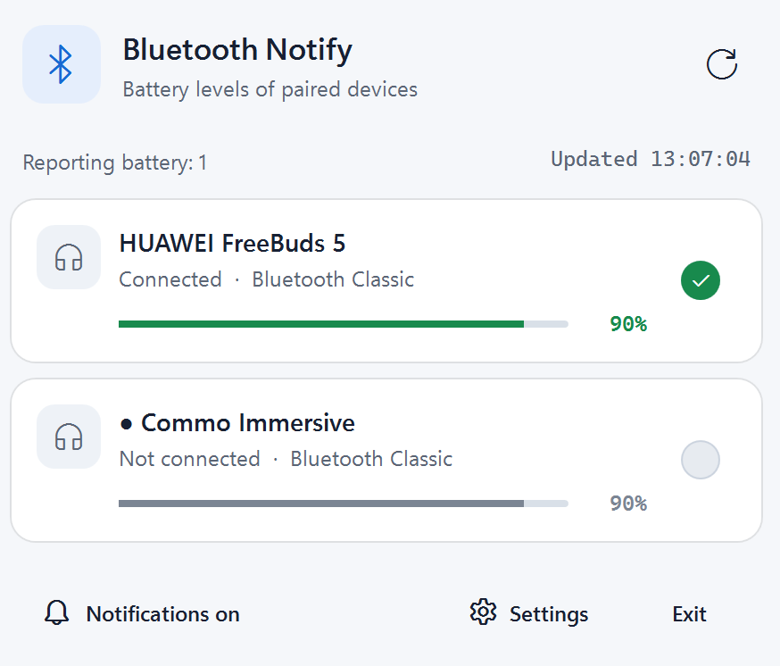
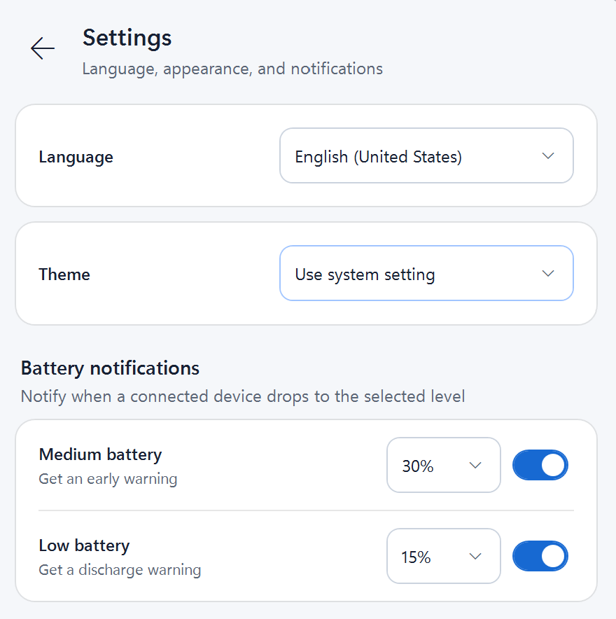
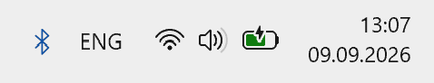

  

<h1 align="center">Bluetooth Notify</h1>

  <strong>Bluetooth 기기의 배터리 잔량, 실제 연결 상태, 네이티브 알림을 Windows 시스템 트레이에서 바로 확인하세요.</strong>

  <a href="./README.md">English</a> ·
  <a href="./README.ru.md">Русский</a> ·
  <a href="./README.de.md">Deutsch</a> ·
  <a href="./README.es.md">Español</a> ·
  <a href="./README.fr.md">Français</a> ·
  <a href="./README.pt-PT.md">Português</a> ·
  <a href="./README.ja.md">日本語</a> ·
  <strong>한국어</strong> ·
  <a href="./README.zh-CN.md">简体中文</a>

  
  
  
  

Bluetooth Notify는 페어링된 Bluetooth 기기를 위한 간결한 Windows 11 트레이 앱입니다. Windows가 보고하는 연결 상태를 표시하고 사용 가능한 모든 배터리 정보원을 확인하며, 기기가 연결되거나 사용자가 정한 배터리 임계값을 지날 때 네이티브 알림을 보냅니다.

## 미리 보기

  <picture>
    <source media="(prefers-color-scheme: dark)" srcset="./resources/main_dark.png">
    <source media="(prefers-color-scheme: light)" srcset="./resources/main_light.png">
    
  </picture>

### 설정 및 시스템 트레이 화면

  <picture>
    <source media="(prefers-color-scheme: dark)" srcset="./resources/settings_dark.png">
    <source media="(prefers-color-scheme: light)" srcset="./resources/settings_light.png">
    
  </picture>

  

## 주요 기능

- **페어링된 모든 기기를 한눈에 확인.** 현재 연결 상태와 Windows가 제공할 수 있는 최신 배터리 잔량을 보여 줍니다.
- **여러 배터리 정보원 지원.** Windows 시스템 값, HFP/PnP 대체 경로, 표준 Bluetooth LE Battery Service를 차례로 확인합니다.
- **불필요한 반복 없는 알림.** 새로 연결될 때와 활성화한 중간 또는 낮은 배터리 임계값을 지날 때 Windows 네이티브 알림을 한 번 보냅니다.
- **트레이 중심의 사용 흐름.** 잠시 마우스를 올리거나 왼쪽 클릭으로 패널을 열고, 오른쪽 클릭으로 네이티브 메뉴를 엽니다.
- **시스템에 맞는 화면.** Windows 테마를 따르거나 밝게 또는 어둡게 모드를 직접 선택할 수 있습니다.
- **9개 UI 언어.** 영어, 러시아어, 독일어, 스페인어, 프랑스어, 포르투갈어, 일본어, 한국어, 중국어 간체를 지원합니다.
- **로컬 데이터.** 설정과 순환 로그는 로컬 앱 데이터 폴더에만 저장되며 계정이 필요하지 않습니다.

## 요구 사항

앱 실행에 필요한 환경:

- Windows 11 22H2(빌드 22621) 이상, x64
- [.NET Desktop Runtime 10 x64](https://dotnet.microsoft.com/download/dotnet/10.0)
- [Windows App Runtime 1.8 x64](https://learn.microsoft.com/windows/apps/windows-app-sdk/downloads-archive#version-18)

게시된 앱은 프레임워크 종속 방식이므로 이러한 런타임이 포함되지 않습니다. 소스에서 빌드하려면 .NET 10 SDK도 설치해야 합니다.

## 소스에서 빠르게 시작하기

~~~powershell
git clone https://github.com/vyach-vasiliev/bluetooth-notify.git
cd bluetooth-notify

dotnet restore .\BluetoothNotify.slnx
dotnet build .\BluetoothNotify.slnx -c Release
dotnet test .\BluetoothNotify.slnx -c Release
dotnet run --project .\src\BluetoothNotify.App\BluetoothNotify.App.csproj -c Release
~~~

앱은 시스템 트레이에서 시작하며 일반 창을 열지 않습니다.

## 사용 방법

- Bluetooth 트레이 아이콘에 약 300ms 동안 마우스를 올리거나 왼쪽 클릭하여 패널을 표시합니다.
- 오른쪽 클릭으로 **열기**, **새로 고침**, **설정**, **종료** 메뉴를 엽니다.
- <kbd>Esc</kbd>를 누르거나, 아이콘과 패널 모두에서 포인터를 벗어나게 하거나, 포커스를 전환하면 패널이 숨겨집니다.
- 패널 아래쪽의 종 버튼으로 연결 알림을 전체적으로 켜거나 끕니다.
- **설정**에서 언어, 화면 모드, 중간/낮은 배터리 알림과 두 퍼센트 임계값을 선택할 수 있습니다. 변경 사항은 재시작 없이 적용됩니다.

패널에는 한 번에 최대 두 개의 기기 카드가 표시되며 나머지는 스크롤해서 볼 수 있습니다. 연결이 끊긴 기기는 마지막으로 알려진 배터리 잔량을 유지할 수 있습니다. 앱은 이 값을 오래된 정보로 표시하며 현재 배터리 보고로 계산하지 않습니다.

## 설정 및 로컬 데이터

- 설정: <code>%LocalAppData%\BluetoothNotify\settings.json</code>
- 순환 로그: <code>%LocalAppData%\BluetoothNotify\logs</code>
- 설치된 앱: <code>%LocalAppData%\Programs\Bluetooth Notify</code>

## 개인정보 보호 및 법적 정보

Bluetooth 기기 이름, Windows endpoint/container ID, 확인 가능한 Bluetooth 주소, 연결 상태, 배터리 잔량은 메모리에서 로컬로 처리되며 게시자에게 전송되지 않습니다. 앱이 디스크에 기록하는 정보는 설정과 순환 기술 로그(<code>5 × 512 KiB</code>)뿐입니다. 운영 체제 오류 메시지에는 때때로 로컬 기술 정보가 포함될 수 있습니다.

개인정보 처리방침, 이용 약관, 면책 조항은 앱의 9개 언어 모두로 <code>site/public/legal</code>에 있습니다. 동일한 독립형 페이지가 <code>/legal/</code>에 게시되고, 앱의 ‘설정 → 법적 정보’에 포함되며, 영어/러시아어 설치 프로그램 화면에도 요약됩니다. [규정 준수 표와 릴리스 체크리스트(러시아어)](./docs/legal-compliance.md)를 참고하세요.

## 게시 및 설치 프로그램 빌드

프레임워크 종속 x64 게시를 만듭니다.

~~~powershell
dotnet publish .\src\BluetoothNotify.App\BluetoothNotify.App.csproj -c Release -r win-x64 --self-contained false
~~~

기본 출력 경로는 <code>src\BluetoothNotify.App\bin\Release\net10.0-windows10.0.22621.0\win-x64\publish</code>입니다. 실행 파일은 DLL, 종속성 파일, PRI 리소스, Windows App SDK bootstrap/projection 라이브러리와 함께 보관해야 합니다.

사용자별 설치 프로그램을 만들려면 [Inno Setup 6](https://jrsoftware.org/isdl.php)을 설치한 후 다음을 실행합니다.

~~~powershell
.\tools\Build-Installer.ps1
~~~

스크립트는 restore, build, test, publish를 수행하고 .NET 런타임이 포함되지 않았는지 확인한 뒤 <code>installer\BluetoothNotify.iss</code>를 컴파일합니다. 출력 파일은 <code>artifacts\installer\BluetoothNotify-Setup-&lt;version&gt;-x64.exe</code>입니다. 설치 프로그램 UI는 영어와 러시아어를 지원하고, 필요한 두 런타임을 확인하며, 관리자 권한 없이 설치합니다. 제거 시 사용자 데이터는 기본적으로 유지됩니다.

테스트 재실행을 생략하려면 <code>-SkipTests</code>를 사용하고, 컴파일러 경로를 직접 지정하려면 다음과 같이 실행합니다.

~~~powershell
.\tools\Build-Installer.ps1 -InnoSetupCompiler 'C:\Tools\Inno Setup 6\ISCC.exe'
~~~

## 배터리 및 연결 상태 확인 방식

1. 문서화된 두 WinRT watcher가 Bluetooth LE와 Bluetooth Classic 기기를 감시합니다.
2. 중복 카드를 막기 위해 레코드를 먼저 Container ID로, 다음으로 Bluetooth 주소로 병합합니다.
3. 배터리 조회는 Windows 시스템 속성, 최선형 HFP/PnP 값, GATT Battery Service <code>0x180F</code> / Battery Level <code>0x2A19</code> 순서로 시도합니다.
4. 읽은 값은 20초 동안 캐시되며, 동시에 최대 4개를 읽고 5초 후 시간 초과됩니다.
5. 패널이 보일 때는 매초 새로 고치고, 숨겨졌을 때는 임계값 알림을 위해 1분마다 확인합니다.

첫 스냅샷은 연결 알림을 보내지 않습니다. <code>Disconnected → Connected</code> 전환에는 3초 디바운스가 적용되며 연결이 끊긴 뒤에만 다시 알림 대상이 됩니다. 배터리 경고는 값이 활성화된 임계값을 위에서 아래로 지날 때 한 번 전송됩니다.

<strong>기여자를 위한 아키텍처</strong>

- <code>BluetoothDeviceMonitor</code> — WinRT watcher, 스냅샷, 연결 이벤트.
- <code>DeviceStateMerger</code> — LE/Classic 중복 제거 및 안정적인 ID.
- <code>BatteryReader</code> 및 <code>PnpBatteryReader</code> — 순서가 있는 배터리 정보원 조회.
- <code>TrayIconService</code> — 네이티브 트레이 아이콘과 메뉴, hover 상태, Explorer 재시작 후 복구.
- <code>PanelPlacementService</code> — 모든 작업 표시줄 방향과 다중 모니터에 대한 DPI-aware 배치.
- <code>TrayPanelViewModel</code> — MVVM 상태, single-flight 새로 고침, Dispatcher 기반 컬렉션 업데이트.
- <code>LocalizationService</code> 및 <code>ThemeManager</code> — 실행 중 언어와 화면 모드 변경.
- <code>NotificationService</code> — AppUserModelID <code>BluetoothNotify.App</code>을 사용하는 Windows App SDK 알림.
- <code>SettingsStore</code> 및 <code>AppLogger</code> — 원자적 JSON 저장과 순환 로컬 로그.

## Bluetooth 제한 사항

연결 상태는 읽기 전용입니다. Windows는 모든 Bluetooth 기기 유형을 연결하거나 연결 해제할 수 있는 하나의 공개 API를 제공하지 않습니다. 따라서 Bluetooth Notify는 기기를 페어링하지 않으며, 장치 관리자, 레지스트리 변경, 역공학된 HID 명령 또는 제조사 전용 프로토콜을 사용하지 않습니다.

배터리 정보를 확인할 수 있는지는 Windows와 기기가 공개하는 정보에 따라 달라집니다. HFP/PnP 속성은 분리된 비문서화 최선형 대체 경로입니다. 이 값이 바뀌거나 없어도 다른 정보원은 계속 작동합니다. 연결이 끊긴 기기에는 오래된 것으로 명확히 표시한 시스템 값을 보여 줄 수 있으며, 이를 갱신하기 위해서만 GATT 연결을 열지는 않습니다.

## 테스트

~~~powershell
dotnet test .\BluetoothNotify.slnx -c Release
~~~

테스트는 LE/Classic 병합, 안정적인 ID, 정렬, 아이콘 매핑, 배터리 임계값과 누락 값, 연결 디바운스, single-flight 새로 고침, 설정, 현지화, 화면 모드, 100/125/150/200% DPI의 패널 배치를 다룹니다.

기록된 하드웨어 및 설치 프로그램 검사는 [상세 검증 보고서(러시아어)](./docs/verification-report.md)에서 확인할 수 있습니다.

## 참고 자료

- [Windows 앱 알림 개요](https://learn.microsoft.com/windows/apps/develop/notifications/)
- [Bluetooth GATT 클라이언트](https://learn.microsoft.com/windows/apps/develop/devices-sensors/gatt-client)
- [Shell_NotifyIcon](https://learn.microsoft.com/windows/win32/api/shellapi/nf-shellapi-shell_notifyiconw)
- [Shell_NotifyIconGetRect](https://learn.microsoft.com/windows/win32/api/shellapi/nf-shellapi-shell_notifyicongetrect)
- [타사 구성 요소 고지](./THIRD-PARTY-NOTICES.md)
